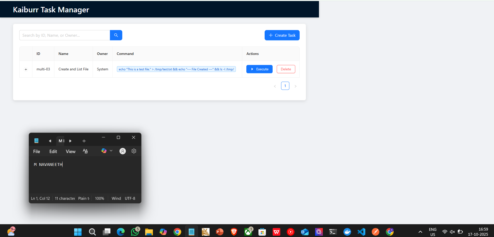
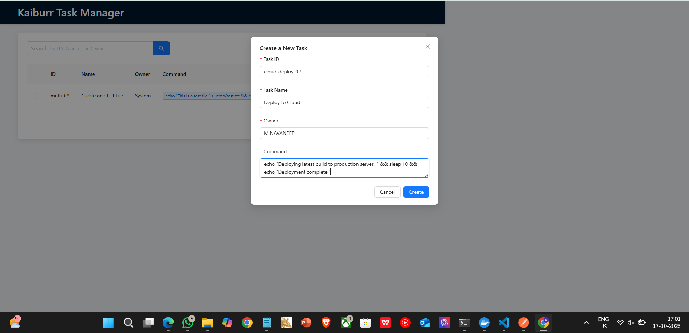
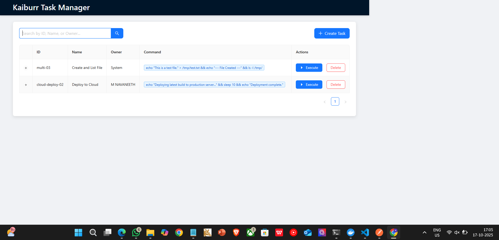
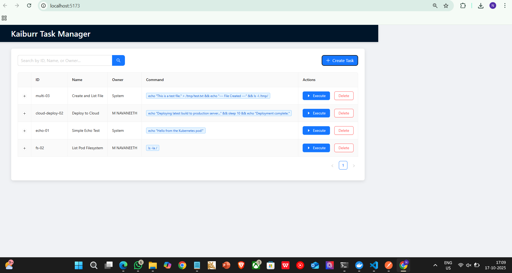
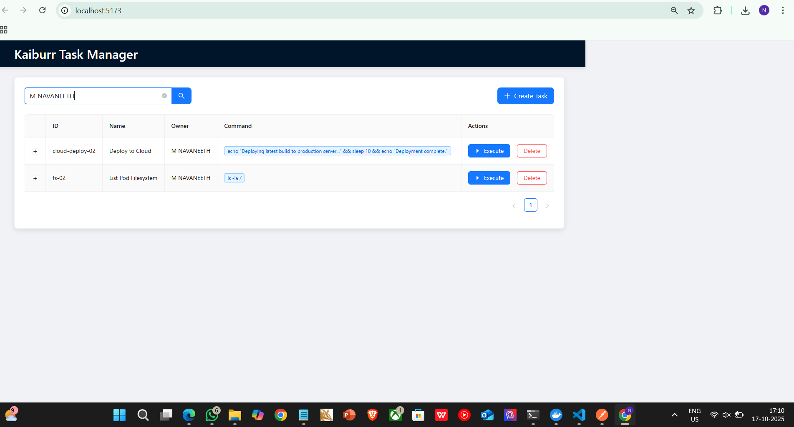
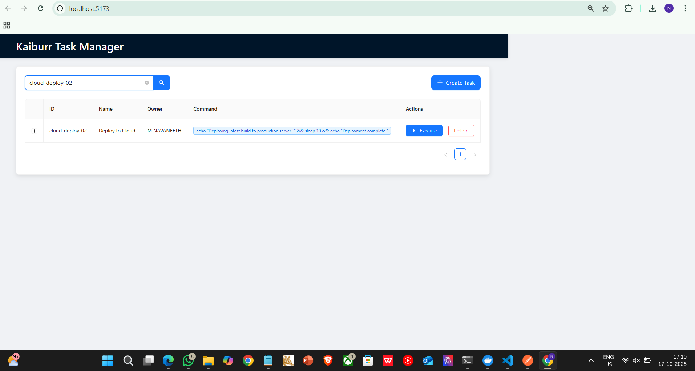
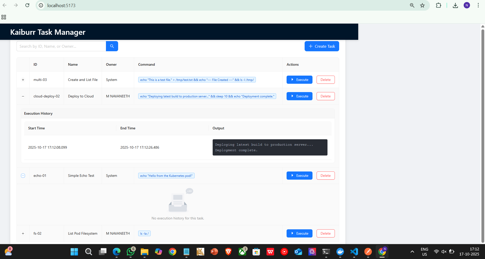
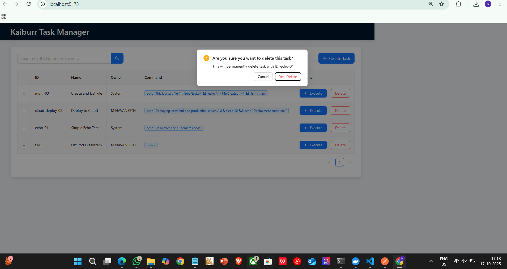
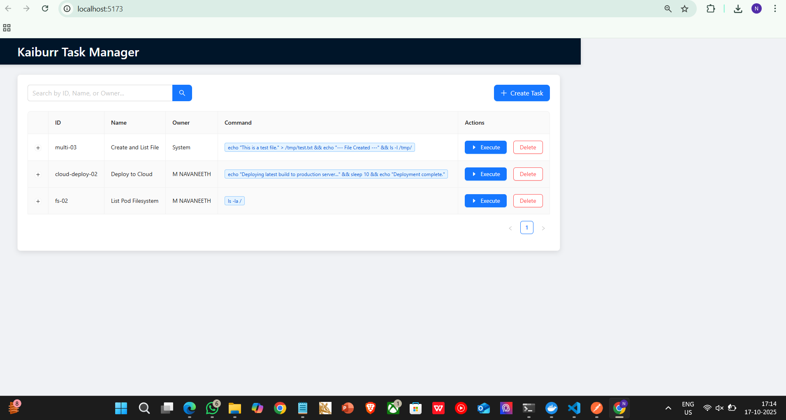

# Kaiburr Assessment - Task 3: Professional Web UI with React & Ant Design

## 🚀 Project Overview

This repository contains the source code for a modern, responsive web frontend for the Kaiburr Task Management API. Built with React, TypeScript, and the Ant Design library, this application provides a complete and user-friendly interface for all task management operations.

The primary focus of this project was on **usability and creating a professional user experience**. The UI features a clean, dashboard-style layout, clear user feedback, and intuitive controls for creating, searching, executing, and deleting tasks. The final design is a polished, card-based dashboard that is both visually appealing and highly functional.

---

## 🛠️ Technology Stack

* **Framework:** React 19
* **Language:** TypeScript
* **Build Tool:** Vite
* **UI Library:** Ant Design
* **Icons:** Ant Design Icons
* **API Client:** Axios

---

## ✨ Features Implemented

* **Full CRUD Operations:** A complete interface for Creating, Reading, Updating (via execution), and Deleting tasks.
* **Real-time Global Search:** An instant client-side search that filters tasks by ID, Name, or Owner.
* **Task Execution:** A one-click "Execute" button that calls the backend API to run commands in a Kubernetes pod.
* **Execution History:** An expandable accordion view for each task to display the detailed history of every execution.
* **Superior User Feedback:** Interactive loading states, success/error messages, and confirmation dialogs for a smooth user experience.
* **Polished UI/UX:** A professional, responsive card-based layout with a cohesive color scheme and custom styling.

---

## 📋 How to Run the Application

### Prerequisites
* Node.js and npm installed.
* The backend API from Task 2 must be running in a Kubernetes cluster.

### 1. Clone the Repository
```bash
git clone [https://github.com/m-navaneeth8770/kaiburr-react-ui-task.git](https://github.com/m-navaneeth8770/kaiburr-react-ui-task.git)
cd kaiburr-react-ui-task
```

### 2. Configure the API Endpoint
* Run `minikube service kaiburr-app-service --url` to get the backend URL.
* Open the `src/api.ts` file and update the `API_BASE_URL` constant with this URL.

### 3. Install Dependencies and Run
```bash
# Install all required packages
npm install

# Start the local development server
npm run dev
```
The application will be available at `http://localhost:5173`.

---

## 📸 UI Showcase & Testing Walkthrough

The following screenshots provide a step-by-step walkthrough of the application's features, demonstrating a complete and successful testing cycle.

### 1. Initial Dashboard State
The application loads with an existing task, proving successful initial data fetching from the API.



### 2. Creating a New Task
The "Create New Task" modal provides a user-friendly form for adding new tasks to the system.



### 3. Verifying Task Creation
After submission, the dashboard automatically refreshes, and the newly created task appears in the grid.



### 4. Populating More Data for Robust Testing
To thoroughly test the search functionality, two additional tasks were added to the dashboard.



### 5. Global Search by Owner
The search bar successfully filters the grid in real-time, showing only the tasks matching the owner name "M NAVANEETH".



### 6. Global Search by ID
The search functionality is confirmed to work across multiple fields, here showing the specific task matching the ID "cloud-deploy-02".



### 7. Task Execution and History
This screenshot demonstrates a successful task execution. The accordion panel for the executed task is expanded, showing the captured output, while the other task with no execution shows no history.



### 8. Safe Delete Operation
To prevent accidental data loss, a confirmation modal appears when a user initiates a delete action.



### 9. Verifying Task Deletion
After confirming the deletion, the dashboard updates, and the task with ID "echo-01" is successfully removed, confirming the end-to-end delete functionality.



---
